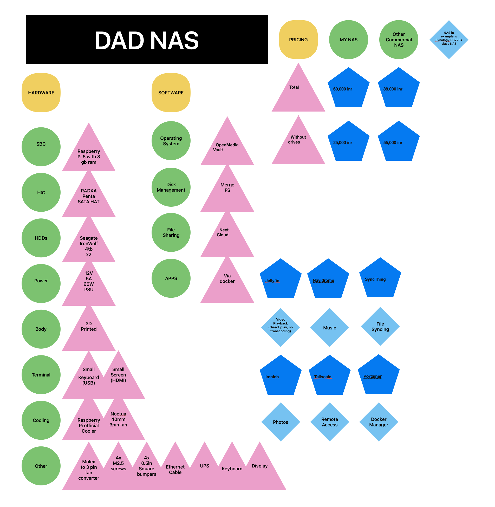

## DAD RPi NAS (BOM)  
## HARDWARE:  
1. Raspberry pi 5 w/ 8 GB of ram```                            ```₹12,000  
2. Radxa Penta for RPi 5```                                   ```₹6,000  
3. Raspberry Pi active cooler```                              ```₹500  
4. Kingston XS1000```                                         ```₹2,000  
5. Noctua 40mm 3 pin fan```                                   ```₹2,000  
6. molex to 3 pin fan converter```                            ```₹500  
7. 12V 5V 60W psu barrel jack```                              ```₹1,500  
8. Case```                                                    ```₹4,000  
9. Miscellaneous```                                           ```₹200  
10. Hard Drives (Seagate ironwolf 4Tb nas sata hdds)```       ```₹16,000 x2 (₹32,000)  
```
BONUS HARDWARE
1. Ethernet cable - Ethernet Support
2. UPS - Uninterruptible Power Supply
3. Display - Monitoring and statistics
4. Keyboard - Terminal and debugging
5. Extra Hard Disks - More Storage

```
## PRICING:  
**TOTAL**: ₹60,000  
**TOTAL WITHOUT DRIVES**: ₹25,000  
**Similar NAS Price**: 88,000  
**SIMILAR NAS PRICE WITHOUT HDD**: ₹55,000  
```
NAS taken in example is Synology DS723+ class NAS

```
## BUILDING TUTORIAL:  
3d prints and build instructions  
```
https://www.printables.com/model/1344785-raspberry-pi-5-radxa-penta-sata-hat-nas-case

```
## SOFTWARE:  
1. OS – OpenMediaVault  
2. DISK CONTROL – ~~RAID 1~~ Mergefs 
3. Container Engine – Docker  
4. Docker Manager – Portainer  
5. Video Playback – Jellyfin  
6. Music – Navidrome  
7. Photos – Immich  
8. Remote Access – Tailscale  
9. Device Sync – Syncthing  
10. Cloud system – Nextcloud  
## FLOWCHART:  
  
  
  
## CHECKLIST:  
### Pre deadline  
- [x] Around half the price of a synology nas  
- [x] Understand nas  
- [x] What is ugreen nas  
- [x] Finish before deadline of 25th March  
- [ ] Have a good looking cohesive build that can compete with commercial products   
### Post deadline  
- [ ] Get approved by dad  
- [ ] Place orders  
- [ ] Everything arrives  
- [ ] Build started  
- [ ] Build finished  
- [ ] Software started  
- [ ] Software finished  
## BUILD:   
- [ ] Complete  
## CREDITS:

### Case Design
Raspberry Pi 5 + Radxa Penta SATA HAT NAS Case  
Source: https://www.printables.com/model/1344785-raspberry-pi-5-radxa-penta-sata-hat-nas-case  

Licensed under Creative Commons Attribution-NonCommercial 4.0 International (CC BY-NC 4.0).  
Changes may include hardware adjustments for component compatibility.

### Software Credits
Open source tools used in this project:

- OpenMediaVault
- Docker
- Portainer
- Jellyfin
- Navidrome
- Immich
- Tailscale
- Syncthing
- Nextcloud

All respective trademarks and copyrights belong to their owners.
