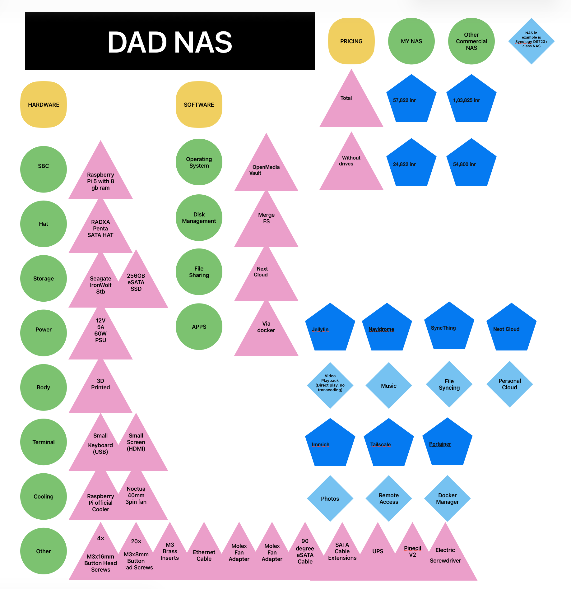

## DAD RPi NAS (BOM)  
## HARDWARE:  
| Component | Item | PRICE |
|-----------|------|-------|
| SBC | Raspberry Pi 5 | ₹12,000 |
| SATA Hat | Radxa Penta SATA Hat | ₹5,000 |
| Storage | 4TB Seagate Ironwolf NAS HDD | ₹16,000 |
| Boot Storage | 256GB eSATA SSD | ₹3,000 |
| Power | 12V 5A 60W Barrel Power Adapter | ₹600 |
| Cooling | 80mm Slim Fan | ₹1000 |
| Cooling | Pi 5 Active Cooler | ₹500 |
| Cable | SATA Cable Extensions | ₹120 |
| Cable | 90 degree eSATA Cable | ₹800 |
| Cable | Barrel Jack Extension | ₹1,000 |
| Adapter | Molex Fan Adapter | ₹600 |
| Hardware | M3 Brass Inserts | ₹150 |
| Hardware | 20× M3x8mm Button Head Screws | ₹40 |
| Hardware | 4× M3x16mm Button Head Screws | ₹12 |
| Case | Robu.in ePLA + ASA + PETG | ₹7,609 |
```
BONUS HARDWARE
1. Ethernet cable - Ethernet Support
2. UPS - Uninterruptible Power Supply
3. ~~Display~~ E-Paper - Monitoring and statistics
4. ~~Keyboard~~ - Terminal and debugging
5. Extra Hard Disks - More Storage
6. Pinecil V2 - Soldering Iron
7. Electric Screwdriver - USB-C interchangeable magnetic bit electric screwdriver
```
## PRICING:  
| Category | Price |
|----------|------|
| TOTAL | ₹48,431 |
| TOTAL WITHOUT DRIVES | ₹32,431 |
| Similar NAS Price | ₹1,03,825 |
| SIMILAR NAS PRICE WITHOUT HDD | ₹54,800 |
```
NAS taken in example is Synology DS723+ class NAS

```
## BUILDING TUTORIAL:  
3d prints and build instructions  
```
~~[Printables model link](https://www.printables.com/model/1344785-raspberry-pi-5-radxa-penta-sata-hat-nas-case)~~
Instructions: https://the-diy-life.com/building-a-4-bay-3-5-nas-with-a-raspberry-pi-5-and-3d-printed-enclosure/
3D prints: https://makerworld.com/en/models/1605027-raspberry-pi-5-based-4-bay-nas#profileId-1692368


```
## SOFTWARE:  
| # | Category | Software |
|---|----------|----------|
| 1 | OS | OpenMediaVault |
| 2 | Disk Control | ~~RAID 1~~ mergerfs |
| 3 | Container Engine | Docker |
| 4 | Docker Manager | Portainer |
| 5 | Video Playback | Jellyfin |
| 6 | Music | Navidrome |
| 7 | Photos | Immich |
| 8 | Remote Access | Tailscale |
| 9 | Device Sync | Syncthing |
| 10 | Cloud System | Nextcloud |
## FLOWCHART:  
  
  
  
## CHECKLIST:  
### Pre deadline  
- [x] Around half the price of a synology nas  
- [x] Understand nas  
- [x] What is ugreen nas  
- [x] Finish before deadline of 25th March  
- [ ] Have a good looking cohesive build that can compete with commercial products   
### Post deadline  
- [ ] Get approved by dad  
- [ ] Place orders  
- [ ] Everything arrives  
- [ ] Build started  
- [ ] Build finished  
- [ ] Software started  
- [ ] Software finished  
## BUILD:   
- [ ] Complete

## Directory Tree:
├── Build Details
│   ├── .DS_Store
│   ├── 3D models
│   │   ├── .DS_Store
│   │   ├── All Together
│   │   │   └── Pi+5+3.5+NAS.3mf
│   │   ├── Drive 1 Tray Handle.stl
│   │   ├── Drive 2 Tray Handle.stl
│   │   ├── Drive 3 Tray Handle.stl
│   │   ├── Drive 4 Tray Handle.stl
│   │   ├── Drive Handle Washer.stl
│   │   ├── Drive Tray.stl
│   │   ├── Fan Cover.stl
│   │   ├── NAS Body Back.stl
│   │   ├── NAS Body Front.stl
│   │   └── SATA Holder.stl
│   └── Build Instructions.pdf
├── image.png
├── LICENSE
└── README.md

## CREDITS:

### Case Design
Raspberry Pi 5 + Radxa Penta SATA HAT NAS Case  
Source: https://www.printables.com/model/1344785-raspberry-pi-5-radxa-penta-sata-hat-nas-case  

Licensed under Creative Commons Attribution-NonCommercial 4.0 International (CC BY-NC 4.0).  
Changes may include hardware adjustments for component compatibility.

### Software Credits
Open source tools used in this project:

- OpenMediaVault
- Docker
- Portainer
- Jellyfin
- Navidrome
- Immich
- Tailscale
- Syncthing
- Nextcloud

All respective trademarks and copyrights belong to their owners.
